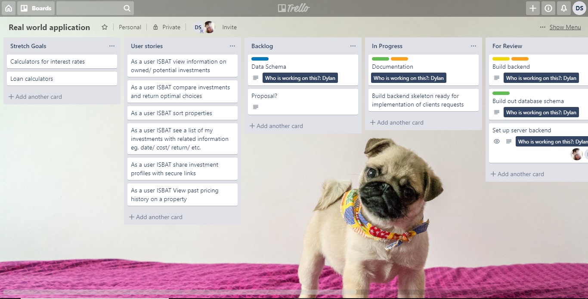
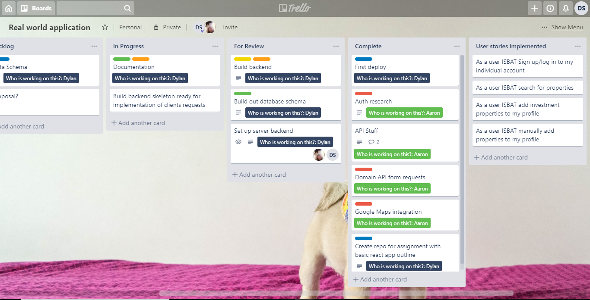
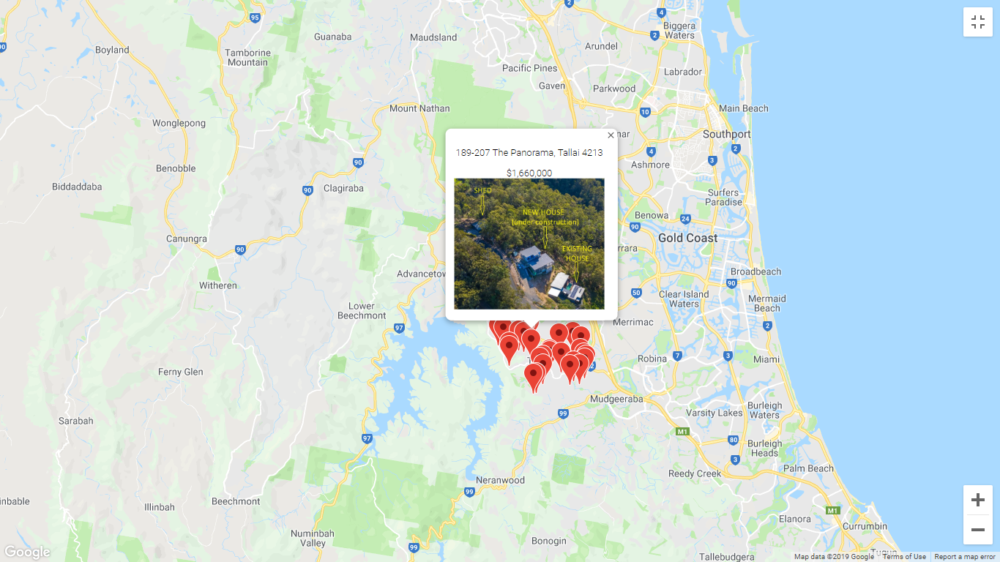
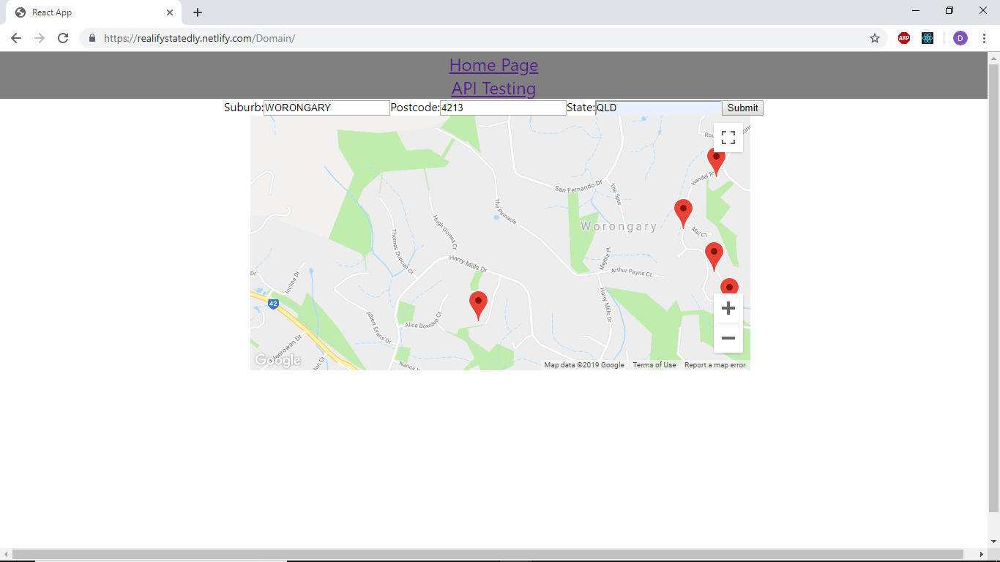

# Real World Application Project

[Deployed Application Link](https://realifystatedly.netlify.com)

[Front End Github Repo Link](https://github.com/Dylan-Speight/real-world-application)

[Back End Github Repo Link](https://github.com/Dylan-Speight/real-world-application-backend)

## Table of Contents

<!-- code_chunk_output -->

- [Real World Application Project](#Real-World-Application-Project)
  - [Table of Contents](#Table-of-Contents)
  - [Description of project](#Description-of-project)
    - [Problem definition/ purpose](#Problem-definition-purpose)
    - [Functionality / features](#Functionality--features)
    - [Screenshots](#Screenshots)
    - [Tech stack (MERN)](#Tech-stack-MERN)
    - [Instructions on how to setup, configure, deploy and use the app](#Instructions-on-how-to-setup-configure-deploy-and-use-the-app)
  - [Design documentation](#Design-documentation)
    - [User stories](#User-stories)
    - [Workflow diagram of the user journey/s](#Workflow-diagram-of-the-user-journeys)
    - [Database ERD](#Database-ERD)
    - [Data Flow Diagram](#Data-Flow-Diagram)
    - [Details of project Management and Planning process](#Details-of-project-Management-and-Planning-process)
      - [Screenshots of trello boards](#Screenshots-of-trello-boards)
    - [Screenshots of app in progress](#Screenshots-of-app-in-progress)
  - [Short answer questions](#Short-answer-questions)
    - [What are the most important aspects of quality software](#What-are-the-most-important-aspects-of-quality-software)
    - [What libraries are being used in the app and why](#What-libraries-are-being-used-in-the-app-and-why)
    - [A team is about to engage in a project, developing a website for a small business. What knowledge and skills would they need in order to develop the project](#A-team-is-about-to-engage-in-a-project-developing-a-website-for-a-small-business-What-knowledge-and-skills-would-they-need-in-order-to-develop-the-project)
    - [Within your own project what knowledge or skills were required to complete your project, and overcome challenges](#Within-your-own-project-what-knowledge-or-skills-were-required-to-complete-your-project-and-overcome-challenges)
    - [Evaluate how effective your knowledge and skills were this project, using examples, and suggest changes or improvements for future projects of a similar nature](#Evaluate-how-effective-your-knowledge-and-skills-were-this-project-using-examples-and-suggest-changes-or-improvements-for-future-projects-of-a-similar-nature)

<!-- /code_chunk_output -->

## Description of project

### Problem definition/ purpose

 After discussing with the client we have been tasked with creating a real estate application. The purpose of this application is to assist a user in making the best possible real estate investments based on the properties expected return on investment. By taking the information given by the Domain api we are able to create a calculator to assist in allowing the user to make the best possible investment choices. This app will allow the user to see various statistics about the property they are interested in investing in. Users will be able to save and keep track of any properties that they are thinking about investing in making it easier to track changes in the real estate market effecting the expenses or rental prices etc.
  
### Functionality / features

 Users are able to sign up to the app and log into their account giving them their own personal profile to search through properties that they may be interested in. Users will be able to search and filter their results based on the state, postcode, suburb, street, house number price etc. If the user finds a investment property they are interested they are able to save it to their profile so that they can come back and quickly access the information relevant to their choices.
  
### Screenshots
  
### Tech stack (MERN)

_**|   Node.js    |**_
  
  Node.js is an open-source, cross-platform JavaScript run-time environment that executes JavaScript code outside of a browser. This allows the developer to run scripts server-side enabling a dynamic webpage. It also allows for javascript to be used in the backend so that javascript can be used frontend to backend.
  
_**|   Express    |**_
  
  Express is a web application framework for Node.js and is the de facto standard server framework for Node.js.
  
_**|   React    |**_

React is a javascript library for building user interfaces. React is optimal for fetching rapidly changing data that needs to be recorded. Recently it has been made even more powerful by introducing hooks in 16.8.0 allowing for its own inbuilt state management allowing for easier state management without redux.

_**|   Mongodb    |**_

MongoDB is a cross-platform document-oriented database program. It is a non relational database that allows for data to be stored and recieved without the data being modeled outside the tabular relations used in relational databases. Data is conceptualized as an object this allows the database to be a lot more intuitive to work with since 'everything is an object' it also allows for a lot more flexibility in its design  as we are not bound to columns and rows.

_**|   Mongoose    |**_

Mongoose is an Object Data Modeling (ODM) library for MongoDB and Node.js. It manages relationships between data, provides schema validation, and is used to translate between objects in code and the representation of those objects in MongoDB.

### Instructions on how to setup, configure, deploy and use the app

Note: If you would like to make changes please fork the repo as well

## Design documentation

- Design process
  
  _**In the beginning: Planning**_

  With the introduction of a client the design process is different from previous projects built in this course. The design now has a lot more to do with regulating expectations in the finished app as we have only limited time and experience in building apps from scratch. The advantage to having a client is that the app begins with a goal that is to be achieved so the design of the app is more of an exercise in seeing how the end goal can be achieved.

  _**Initialization**_

  After talking with the client to begin with we went into the design of the database and the general structure of the app. After knowing what information it was that we were trying to get and where we were going to get it from we began our first short sprint modeling out the dataflow and initializing the back and front end and setting up the initial deployment.
  
  _**Getting to it**_

  After we had the basics down we could look harder into how we were going to retrieve and pass data. We decided on user accounts to allow people to store their liked investment properties and the information we would request from the domain api. This gave us our database an outline and a direction for the front end to head in. Displaying a map from the google maps javascript api and linking it with the domain api to show markers on the map for location along with the cards that give a brief overview of the properties within the scope of the search terms and filters provided by the user.

  _**Pretty and Functional**_

  With the basics down we worked towards getting it looking nice and making sure that the functionality of the app was smooth and responsive. This is also where the user experience factored in a bit more as we wanted to make the app accessible to the user and not just something that would be dificult to navigate and find out what they were looking for. Putting together a user flow for the intended navigation of the site and the layout that would be most ideal to serve these purposes. Wireframes and diagrams were definitely an asset here in making sure that we had an idea of how everything will be layed out in the end.

  Constant communication with the client assisted in our progress as they already had somewhat of an end goal in sight beforehand which made this particular part of the design progress much smoother as we could run everything by them.

### User stories

### Workflow diagram of the user journey/s

- Wireframes

### Database ERD

 

### Data Flow Diagram

- OO design documentation
  
### Details of project Management and Planning process

- Project plan and timeline
- Client communications

#### Screenshots of trello boards
  

### Screenshots of app in progress

## Short answer questions

### What are the most important aspects of quality software

_**Flexibility and Extensibility**_

Flexibility is the ability of software to add/modify/remove functionality without damaging the current system. Extensibility is the ability to extend software and add functionality without damaging system, so it may be thought of as a subset of flexibility. These changes in the software may occur if requirements of the software change or if new or improved features come in for the original software. Software is always changing so it is important to be able to adapt and change along with it.

_**Maintainability and Readability**_

Maintainability is a little similar with flexibility but it focuses on modifications about error corrections and minor function modifications, not major functional extensibilities. It can be supported with useful interface definitions, documentation, and self-documenting code and/or code documentation. The more correct and useful documentation exists, the more maintainability can be performed.

_**Performance and Efficiency**_

Performance is mostly about optimizing your software to improve response times in your software and efficiency is more about lowering resource cost. For example improving performance will shorten response times to an acceptable level and keep them at those levels even if transaction count increases. On the other hand getting instant responses by increasing resource use will improve the performance but will increase costs due to more resources being used. This is where the efficiency of the software comes in, finding the ideal resources/ performance ratio is important and should be aimed for.

_**Usability and Accessability**_

User interfaces are the only visible parts of software according to the viewpoint of user. So, simplicity, taking less time to complete a job, the ability to easily navigate, simplicity in design etc. are very important in this case. Keeping the software simple and not trying to throw too much at the user at once will help to create an enjoyable and worthwhile experience for the user. Simple is always the best. A usable software should also support different accessibility types of control for people with disabilities. These may range from the colour scheme to making sure that the sites layout allows for efficient tab navigating.

_**Functionality**_

Functionality is the conformity of the software with actual requirements and specifications. If the software is unable to perform its intended purpose efficiently, in the best possible way then there is definitely room to be improved on. Also important is that it does not contain bugs or other issues that may impede the softwares ability to achieve its end goal for the user.

### What libraries are being used in the app and why

_**React**_

_**MongoDB**_

_**Express**_

_**Node.js**_

_**Mongoose**_

_**Material UI**_

### A team is about to engage in a project, developing a website for a small business. What knowledge and skills would they need in order to develop the project

The team should first have a strong knowledge of the tech stack they plan on using for the website an example of this is knowing mongodb, react, express and node.js if they are planning on making it with the MERN stack. Next is knowing how to put it all together in a way that will make the best use of their time. Being knowledgeable in how a website is constructed and having a solid understanding of any data flow or anything else that may not be immediately obvious in the project.

Assuming the team has adequate technical skills to build the website they will also need to have some sort of project management ability. Whether it is done as a team or an assigned person leads this it is a necessary component to plan out how the team will be working towards their end goal. Going into a project without a goal or way to get to it are both just asking for failure.

After these aspects the team will still need a strong sense of design too put all of these things together into a coherent website that is well set out and pleasant to use without needing some other knowledge of the website.

Design plays a big part in the user experience but is not the only part that is important to it. The team will have to make sure that their website is also efficient and will give the user a great experience by reducing load times and making the site both accessible and usable.
  
### Within your own project what knowledge or skills were required to complete your project, and overcome challenges

Technical
Design
ux/ui
project management
organisation
api
backend
frontend
linking

### Evaluate how effective your knowledge and skills were this project, using examples, and suggest changes or improvements for future projects of a similar nature

yeah nah good
